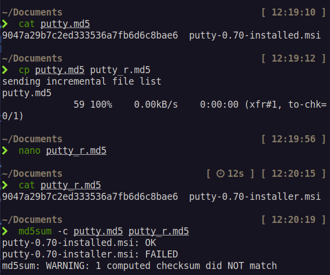
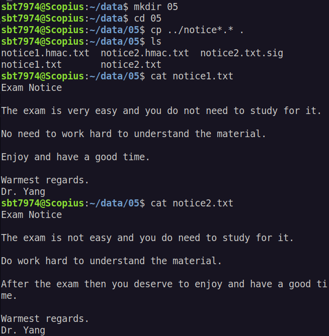
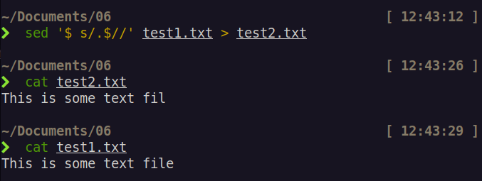

# Information Security Technologies COMP607 Assignment 1

Student Name: **Dao Minh Duc**

AUT Student ID: **23199710**

## 1.

## 2.

### a.

With 7 bits per character, there are 128 possible values for each character in the password. With 10 such characters in a password, the key space of the password will have the size of 128^10.

### b.

There are 10 7-bit characters in the password. Therefore, the key length in bits of it is: 10 \* 7 = 70 bits.

### c.

If only 26 lowercase characters are used, we only need at most 5 bits per character to encode the password. Therefore, the key length in bits in this case will be: 10 \* 5 = 50 bits.

### d.

(i) $128 / 7 = 18$. Therefore, we need at least 18 7-bit characters.

(ii) $128 / 5 = 25.2$. Therefore, we need at least 26 characters.

## 3.

The bit sequence that appears the most frequent is `00011111`, so using frequency attack, we can assume that this sequence represents letter "e", which has the ASCII encode of `01100101`. Therefore, we can assume that the key of this cipher text is: `0b01100101 - 0b00011111 = 0b01000110`.

With that key, we can work out the rest of the message by adding it to the bits in the cipher text.

- `0b00010111 + 0b01000110 = 0b01011101 = m`
- `0b00001110 + 0b01000110 = 0b01010100 = T`
- `0b00011011 + 0b01000110 = 0b01100001 = a`
- `0b00010110 + 0b01000110 = 0b01011100 = \`
- `0b00001100 + 0b01000110 = 0b01010010 = R`
- `0b00010100 + 0b01000110 = 0b01011010 = Z`

The decrypted cipher text is: `meeTaTe\eReZam`

## 4.

## 5.

a.

b.

## 6.

a.

b.

c.

