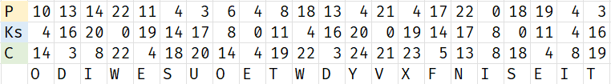
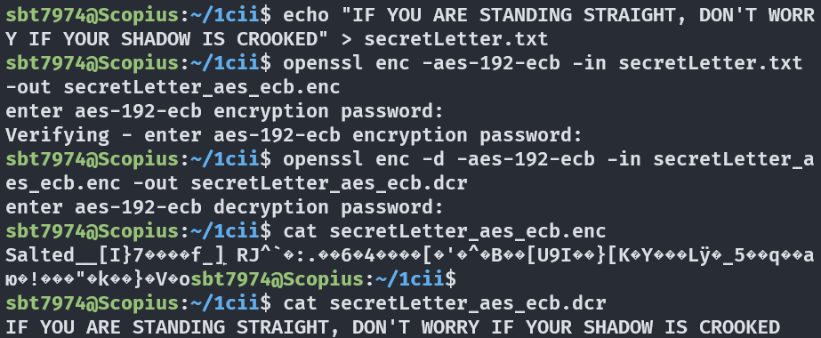
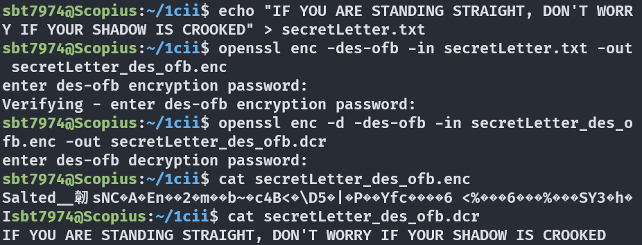
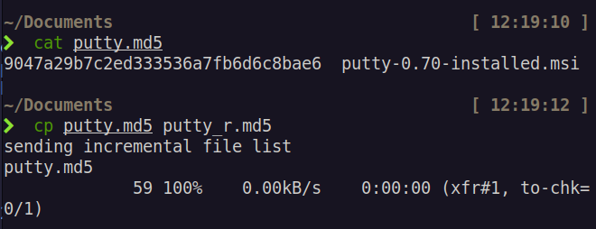

# Information Security Technologies COMP607

# Assignment 1

Student Name: **Dao Minh Duc**

AUT Student ID: **23199710**

## 1.

### a.

Key: 4

Plaintext message: **A GOOD NAME IS BETTER THAN GOOD HABITS**

### b.

Plaintext message: **KNO WLE DGE ISN EVE RWA STE D**

Key: **EQUATORIAL**

$Ks = 4; 16; 20; 0; 19; 14; 17; 8; 0; 11$

The cipher text is: **ODI WES UOE TWD YVX FNI SEI T**

### c.

#### i.

#### ii.

 

 

 

## 2.

### a.

With 7 bits per character, there are $2^7 = 128$ possible values for each character in the password. With 10 such characters in a password, the key space of the password will have the size of $128^{10}$.

### b.

There are 10 7-bit characters in the password. Therefore, the key length in bits of it is: $10 \times 7 = 70$ bits.

### c.

If only 26 lowercase characters are used, we only need at most 5 bits per character to encode the password. Therefore, the key length in bits in this case will be: $10 \times 5 = 50$ bits.

### d.

(i) $128 / 7 = 18$. Therefore, we need at least 18 7-bit characters.

(ii) $128 / 5 = 25.2$. Therefore, we need at least 26 characters.

 

 

 

 

 

 

 

 

 

 

 

 

 

 

 

 

 

## 3.

The bit sequence that appears the most frequent is `00011111`, so using frequency attack, we can assume that this sequence represents letter "E", which has the ASCII encode of `01000101`. Therefore, we can assume that the key of this cipher text is: `00011111 XOR 01000101 = 01011010`.

With that key, we can work out the rest of the message by adding it to the bits in the cipher text.

- `00010111 XOR 01011010 = 01001101 = m`
- `00001110 XOR 01011010 = 01010100 = t`
- `00011011 XOR 01011010 = 01011010 = a`
- `00010110 XOR 01011010 = 01001100 = l`
- `00001100 XOR 01011010 = 01010110 = v`
- `00010100 XOR 01011010 = 01001110 = n`

The decrypted cipher text is: **MEETATELEVENAM**

This can be interprteted in plaintext as: **Meet at eleven AM**

 

 

 

 

 

 

 

 

 

 

 

 

 

 

 

 

 

 

 

 

 

## 4.

Therefore, `putty-0.70-installed.msi` is the good copy.

 

 

 

 

 

 

 

 

 

 

 

 

 

 

## 5.

### a.

 

 

 

 

 

### b.

Therefore, `notice2.hmac.txt` is the authentic version.

 

 

 

 

 

 

 

 

 

 

 

 

 

 

 

 

 

 

 

 

 

 

 

 

 

 

## 6.

### a.

### b.

Conclusion: `test1.txt` and `test2.txt` plaintext files only differs in the last byte (`!` character), but their MD5 hash values are completely different.

### c.

## 7.

### a.

$M = 513, p = 23, q = 29$

$\Rarr N = p \times q = 23 \times 29 = 667$

$\Rarr \phi(N) = (p - 1) \times (q - 1) = 22 \times 28 = 616$

 

Select $e = 5$

$\Rarr d = e^{-1} \mod \phi(N) = 5^{-1} \mod 616 = 493$

Public key: $(e, N) = (5, 667)$

Private key: $(d, N) = (493, 667)$

 

Encrypt $M = 513$ using public key:

$C = M^e \mod N = 513^{5} \mod 667 = 546$

 

Decrypt $C = 546$ using private key:

$M = C^d \mod N = 546^{493} \mod 667 = 513$

### b.

$M = 109, p = 11, q = 23$

$\Rarr N = p \times q = 11 \times 23 = 253$

$\Rarr \phi(N) = (p - 1) \times (q - 1) = 10 \times 22 = 220$

 

Select $e = 3$

$\Rarr d = e^{-1} \mod \phi(N) = 3^{-1} \mod 220 = 147$

Signature: $S = M^d \mod N = 109^{411} \mod 253 = 109$

 

Verify signature:

$M = S^e \mod N = 109^3 \mod 253 = 109$

The signature is verified.

## 8.

### a.

First, Alice and Bob agree on a prime number $n = 4787$ and a generator $g = 2$.

Then, they each choose a secret number, $a$ and $b$, respectively.

Alice chooses $a = 3$ and Bob chooses $b = 5$.

They then calculate their public keys as follows:

Alice: $A = g^a \mod n = 2^3 \mod 4787 = 8$

Bob: $B = g^b \mod n = 2^5 \mod 4787 = 32$

They then exchange their public keys.

Alice receives Bob's public key, $B = 32$, and calculates the shared key as follows:

$K = B^a \mod n = 32^3 \mod 4787 = 4046$

Bob receives Alice's public key, $A = 8$, and calculates the shared key as follows:

$K = A^b \mod n = 8^5 \mod 4787 = 4046$

Both Alice and Bob now have a shared key, $K = 4046$.

### b.

Both Alice and Bob can determine the value of the shared key. The shared key is calculated using the public key of the other party and the secret key of the party itself.

 
 

 
 

## 9.

### i.

$M = 215, a = 198, b = 231, G = 2, p = 443$

Alice calculates her public key:

$A = G^a \mod p = 2^{198} \mod 443 = 144$

Bob calculates his public key:

$B = G^b \mod p = 2^{231} \mod 443 = 305$

Alice sends her public key, $A = 144$, to Bob.

Bob sends his public key, $B = 305$, to Alice.

Alice computes the shared key:

$K = B^a \mod p = 305^{198} \mod 443 = 321$

Alice encrypts the message:

$C = M \times K \mod p = 215 \times 321 \mod 443 = 350$

Alice sends the cipher text, $C = 350$, to Bob.

Bob derives the shared key:

$K = A^b \mod p = 144^{231} \mod 443 = 321$

Bob decrypts the message: $M = C \times K^{-1} \mod p = 350 \times 321^{-1} \mod 443 = 215$

### ii.

$M = 67, a = 11, b = 13, G = 2, p = 17$

Alice calculates her public key:

$A = G^a \mod p = 2^{11} \mod 17 = 8$

Bob calculates his public key:

$B = G^b \mod p = 2^{13} \mod 17 = 15$

Alice sends her public key, $A = 8$, to Bob.

Bob sends his public key, $B = 15$, to Alice.

Alice computes the shared key:

$K = B^a \mod p = 15^{11} \mod 17 = 9$

Alice encrypts the message:

$C = M \times K \mod p = 67 \times 9 \mod 17 = 8$

Alice sends the cipher text, $C = 8$, to Bob.

Bob derives the shared key:

$K = A^b \mod p = 8^{13} \mod 17 = 9$

Bob decrypts the message: $M = C \times K^{-1} \mod p = 8 \times 9^{-1} \mod 17 = 67$
