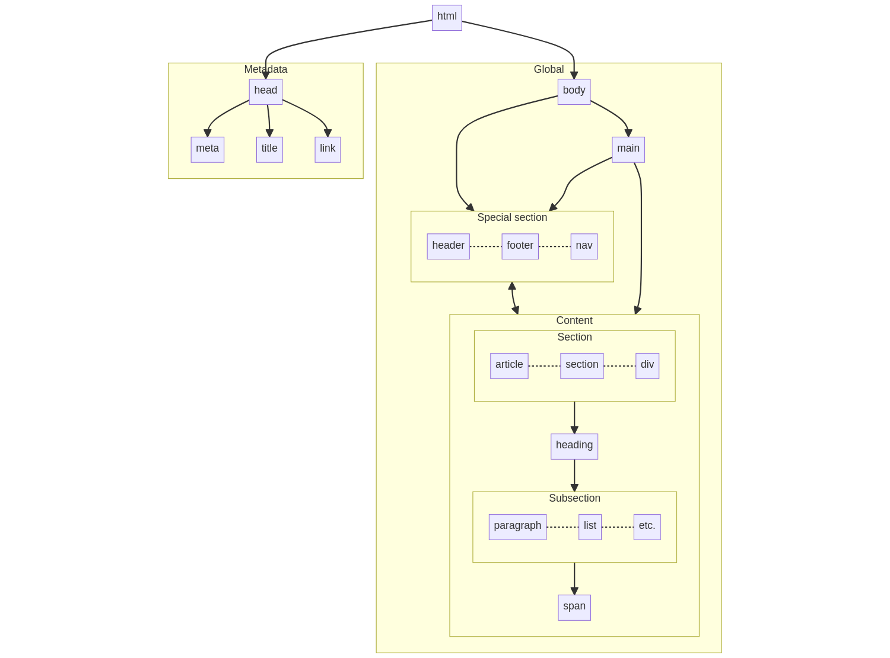

# Week 01 #

## Table of Contents ##

- [Table of Contents](#table-of-contents)
- [HTML](#html)
	- [Basics](#basics)
		- [Block level](#block-level)
	- [Example](#example)
- [CSS](#css)
	- [Basics](#basics-1)
		- [Structure](#structure)
		- [Naming conventions](#naming-conventions)
	- [Styling](#styling)
		- [Fallback value](#fallback-value)
	- [Implement to HTML](#implement-to-html)
		- [Inline](#inline)
	- [Head](#head)
		- [External](#external)


## HTML ##

### Basics ###

- All HTML documents starts with `<!DOCTYPE html>`.

- Overall suggested structure of an HTML document ([details](https://developer.mozilla.org/en-US/docs/Learn/HTML/Introduction_to_HTML/Document_and_website_structure#html_layout_elements_in_more_detail)):

	```mermaid
	graph LR
		container --> |"can contain"| contained
		peer1 -.- |"can contain each other"| peer2
	```

	[](https://mermaid.live/edit#pako:eNqdVE1vgzAM_StRzqU_oJp22Cbtsl7GThs7GOKWaCFBwVSqqv73JYTSpkD34QNyzPOLn-PkwAsjkK_41kJdsreHTDNn4VtSpViS3LMSQVyFciP2l9imzQPFszI5qBD0JqTFgqTRA_k5yZsn6hjTGgsJKg3oCUAFUk8xDFvHDB_9kjVh_XnOiOt6eY3_eLVoWbJM2MYY6l0NuzMMtbhZyaPRhJrmdrzsRMwQ67luxc-1j9m8gSVZKOx09N3ofCF3MTjSNeZKT7n9TEi9HbfOBcN5tnkzJWBO7Az8P3prsBBYvUolG-ocpGL5N71DTZ2ipgY9MwNxbjyI7M4nj0bCjzO7_WfqSgzbXt27NRIIIPj9zfOHFS4WXqYNYZKkcCKupP4aauELXqF1FQv3iBx8OONUYoUZXzlX4AZaRRnP9NFBoSWT7nXBV2RbXPC2diXjk_SnVZ2CKCQZuw7vUvc8Lbjr_LsxDrIB1eDxG5EnRRE)

	- `head` vs `header` vs `heading`:
		- `head` contains the metadata of the page.
		- `header` appears on the top of a section.
		- `heading` is a part of the page's content (eg., `h1`, `h2`, etc.)
	- `article` vs `section` vs `div`:
		- `article`: self-contained piece of content, intended to be independently distributable or reusable.
			- Example: a widget or a group of widgets.
		- `section`: group of related content. Should always have a header.
			- Example: paragraphs about a specific topic.
		- `div`: generic container. Should be avoided whenever possible.

#### Block level ####

- Each block level element will start on a new line and span the full width available (100% of the parent element).

- Levels:

	[](https://mermaid.live/edit#pako:eNpVjzEOgzAMRa-CPHOCjFXXTu1UZTHYQCTiRCEZKsTdMUUtiif7PcvyX6EPxGBgTBin5nWz0mgtpTuBxzQ6OWElupCI0yUqGZHIyVjbo3hmz5JrwUIX-A_aQAuek0dH-uB6YAt50gsWjLbEA5Y5W7Cy6SqWHJ4f6cHkVLiFEgkz3x3qTx7MgPOilMnlkB5n6G_2FiLKO4TfzrYDAXBUOA)
	- Negative value for `margin` will make the element larger.
	- For `margin` and `padding`, the order is: _top, right, bottom, left_ $\rightarrow$ **clock-wise**.

- To make an element to be a part of a block element, use `<span>` tag. [(?)](index.html?plain=1#L37)


### Example ###

[Source](https://developer.mozilla.org/en-US/docs/Learn/HTML/Introduction_to_HTML/Document_and_website_structure#active_learning_exploring_the_code_for_our_example)

```html
<!-- index.html -->

<!DOCTYPE html>
<html lang="en-US">
	<head>
		<meta charset="utf-8" />
		<meta name="viewport" content="width=device-width" />

		<title>My page title</title>
		<link rel="stylesheet" href="style.css" />
	</head>

	<body>
		<!-- Here is our main header that is used across all the pages of our website -->

		<header>
			<h1>Header</h1>
		</header>

		<nav>
			<ul>
				<li><a href="#">Home</a></li>
				<li><a href="#">Contact</a></li>
			</ul>

			<!-- A Search form is another common non-linear way to navigate through a website. -->

			<form>
				<input type="search" name="q" placeholder="Search query" />
				<input type="submit" value="Go!" />
			</form>
		</nav>

		<!-- Here is our page's main content -->
		<main>
			<!-- It contains an article -->
			<article>
				<h2>Article heading</h2>

				<p>
				Lorem ipsum dolor sit amet, consectetur adipisicing elit. Donec a diam
				</p>

				<h3>Subsection</h3>

				<p>
				Donec ut librero sed accu vehicula ultricies a non tortor. Lorem ipsum
				dolor sit amet, consectetur adipisicing elit. Aenean ut gravida lorem.
				</p>
			</article>

			<!-- the aside content can also be nested within the main content -->
			<aside>
				<h2>Related</h2>

				<ul>
				<li><a href="#">Oh I do like to be beside the seaside</a></li>
				<li><a href="#">Although in the North of England</a></li>
				<li><a href="#">It never stops raining</a></li>
				</ul>
			</aside>
		</main>

		<!-- And here is our main footer that is used across all the pages of our website -->

		<footer>
		<p>©Copyright 2050 by nobody. All rights reversed.</p>
		</footer>
	</body>
</html>
```


## CSS ##

### Basics ###

#### Structure ####

`h1 { color: red; }`

- `h1` is the selector
- `color` is the property
- `red` is the value

#### Naming conventions ####

- All lowercase
- Separated by `-` if there are multiple words
- Examples:
	- `education`
	- `content-block`


### Styling ###

- All child elements of an element will **inherit all styles of the parent** element unless overridden.

- An element can inherit multiple classes. For example, **`<h1 class="class1 class2">`**.
	- The styles of both `class1` and `class2` will be applied to the element in the **order that they are defined**.

		```html
		<style>
			.blue-text { color: blue; }
			.pink-text { color: pink; }
		</style>
		
		<h1 class="blue-text pink-text">Hello World!</h1>	<!-- The text will have pink color -->
		<h2 class="pink-text blue-text">Xin chào!</h2>		<!-- The text will also have pink color -->
		```

	- When there are conflicts, the styles of the **last defined class** will be applied.

- Style application priority:
	1. `!important` (overrides all other rules and all `!important`s before it. :warning: _Use responsibly_)
	2. Inline styles [(?)](#inline)
	3. `id`
	4. `class`
	5. Parent element

- Value can be stored in variables

	```css
	:root { --main-color: #FF0; }

	h1 { color: var(--main-color, red); }

#### Fallback value ####

- If for any reasons the browser cannot find the value of a property or run into compatibility issues, it will ignore the property and/or use the default value.
- Fallback value(s) is used to prevent the property from being ignored by adding backup value(s) that should be guaranteed to work on any browser/platform.

	```css
	h1 { font-family: "Times New Roman", Times, serif; }
	/* If the browser cannot find "Times New Roman", it will use "Times" instead */
	/* If "Times" is also not found, it will use "serif" instead. */
	
	.red-box {
		background: var(--red-color, red);
	}
	/* If the browser cannot find the variable, it will use the default value "red" */
	```


### Implement to HTML ###

#### Inline ####

:no_entry_sign: _**Should be avoided**_

```html
<h1 style="color: red;">
	Hello there!
</h1>
```


### Head ###

:warning: _**Not recommended**_

```html
<head>
	<style>
		#education { color: red; } 			/* id */
		div.content-block { color: blue; }	/* class */
	</style>
</head>
```

#### External ####

:heavy_check_mark: _**Recommended**_

- Create a new `.css` file
	- _**Personal reference**_: All the `.css` files should be inside a folder named `styles`. If there are multiple file types used for styling, each types should be in their own folder.
- Put all the CSS code in the file.
- Link the CSS file to the HTML file:

	```html
	<head>
		<link rel="stylesheet" href="styles/style.css">
	</head>
	```
