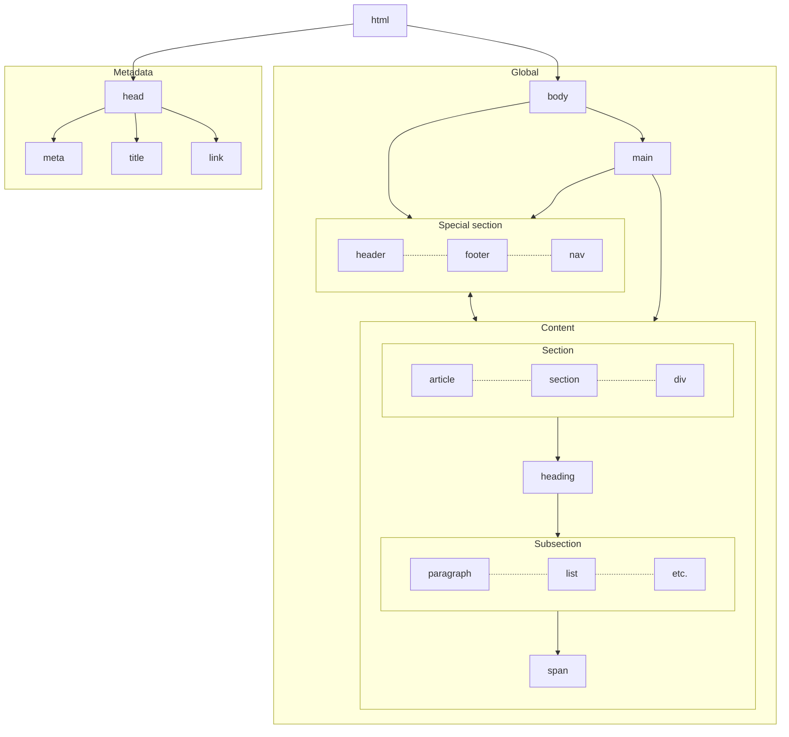
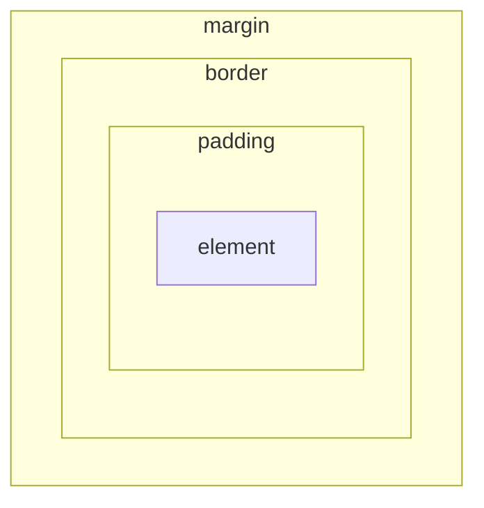

# 01

```mermaid
	graph TB
	
	html --> head
	html --> body
	
	subgraph Global
		direction TB
		
		body --> SpecialSection
		body --> main
		
		subgraph SpecialSection[Special section]
			direction LR
			header -.- footer -.- nav
		end
		
		subgraph Content
			direction TB
			
			subgraph Section
				direction LR
				
				article -.- section -.- div
			end
			
			Section --> heading
			heading --> Subsection
			
			subgraph Subsection
				direction LR
				
				paragraph -.- list -.- etc.
			end
			
			Subsection --> span
		end
			
		SpecialSection <--> Content
		main --> Content
		main --> SpecialSection
	end
	
	subgraph Metadata
		direction TB
		
		head --> meta
		head --> title
		head --> link
	end
```

# 02

```mermaid
graph TB
    subgraph margin
        subgraph border
            subgraph padding
                element
            end
        end
    end
```