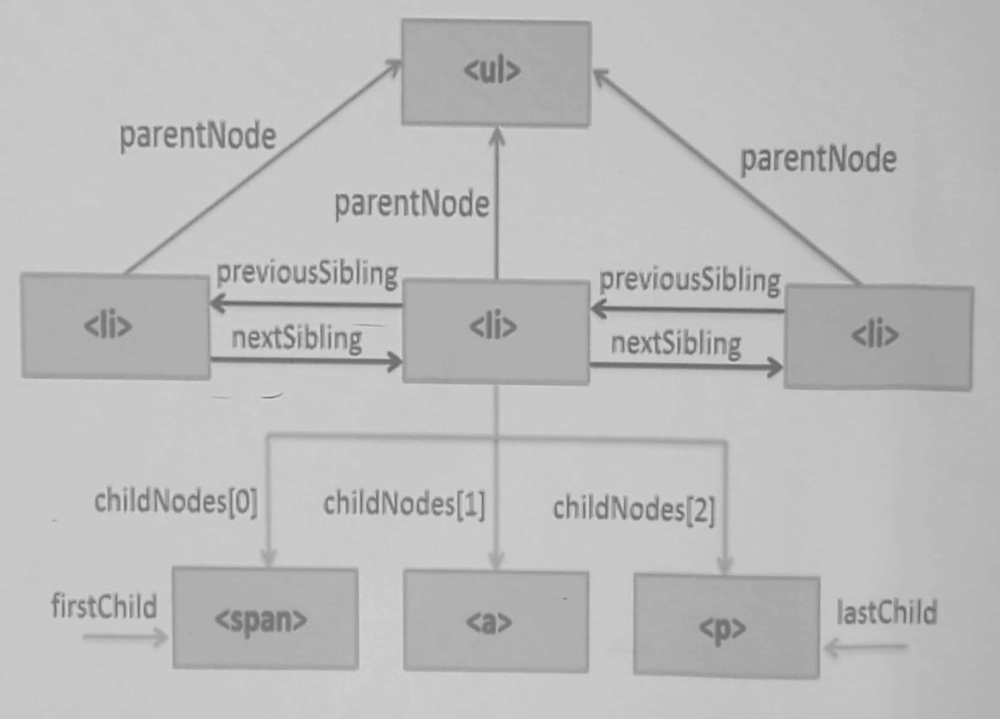

# Week 05

## Table of Contents

- [Table of Contents](#table-of-contents)
- [DOM](#dom)
- [JavaScript](#javascript)
	- [Basics](#basics)
	- [Traversing the DOM](#traversing-the-dom)


## DOM

- Shorthand for _Document Object Model_
- A programming interface for **web documents**
- Represents the document as nodes and objects
- Can be modified with a scripting language (such as JavaScript)

## JavaScript

- Object-oriented → access objects and methods using dot notation
- Interpreted → no compilation step

### Basics

- Declare variable using `let` or `const`

```js
let msg = "Hello there!";
```

- Declare function using `function` keyword

```js
function sayHello() {
	console.log("Hello there!");
}
```

- Print pop-up message using `alert()`

```js
alert("What's up!");
```

- Select HTML elements using `querySelector(<...>)` or `querySelectorAll(<...>)`

```js
let h1 = document.querySelector("h1");	// Selects first h1 tag
let p = document.querySelectorAll("p");	// Selects all p tags
let logoImg = document.querySelector("div.logo img");	// Selects first img tag inside div.logo

let nav = document.querySelector("nav");
let navItems = nav.querySelectorAll("li");
```

- Get/Set attributes using `getAttribute(<...>)` and `setAttribute(<...>)`

```js
logoImg.getAttribute("src");
logoImg.setAttribute("alt", "Something descriptive");
```

### Traversing the DOM


