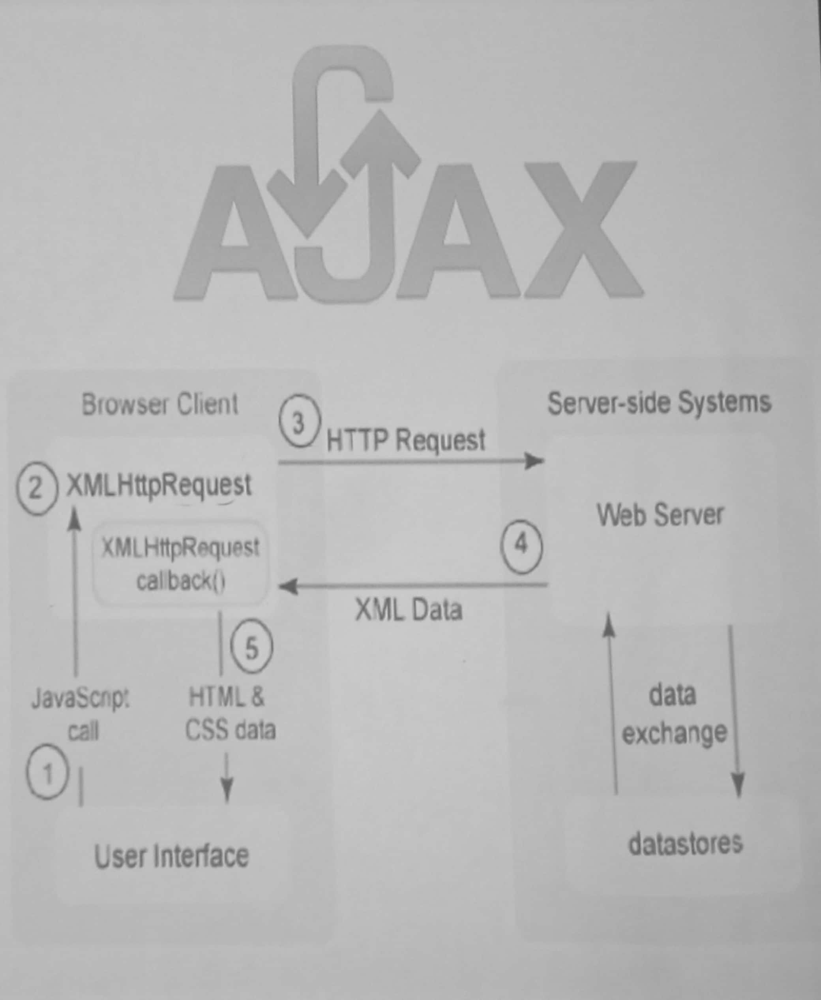
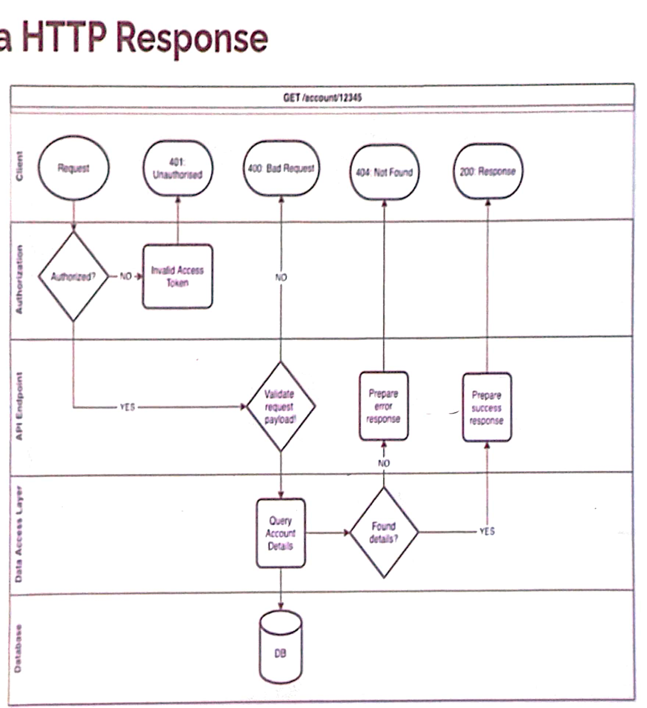

# Week 08

# Table of Contents
- [AJAX](#ajax)
	- [Basics](#basics)
	- [XMLHttpRequest](#xmlhttprequest)
		- [Demo](#demo)
		- [HTTP response handling](#http-response-handling)


## AJAX

### Basics

- For sharing data resources between different web pages by read data from a web server _**asynchronously**_ without reloading the entire page.
	- _Asynchronous_ means that the web page does not have to wait for the server response to continue its execution.

- This is done by using the `XMLHttpRequest` object. Modern browsers also support (and prefered) the `fetch()` API.
	- `fetch()` allows web browser to make HTTP requests to web servers and load the response data as `JSON`, `XML`, `text`, or `blob` data types.
- 

### XMLHttpRequest

#### Demo

```js
// Create a new XMLHttpRequest object
var xhr = new XMLHttpRequest();

// Open a request to the server
xhr.open('GET', 'https://randomuser.me/api');

// Set the response type
xhr.responseType = 'json';

// Send the request
xhr.send();

// Handle the response
xhr.onload = function() {
	if (xhr.status != 200) { // analyze HTTP status of the response
		alert(`Error ${xhr.status}: ${xhr.statusText}`); // e.g. 404: Not Found
	} else { // show the result
		alert(`Succeed, got ${xhr.response.length} bytes`); // response is the server
	}
};

// Extras
xhr.onprogress = function(event) {
	if (event.lengthComputable) {
		alert(`Received ${event.loaded} of ${event.total} bytes`);
	} else {
		alert(`Received ${event.loaded} bytes`); // no Content-Length
	}
};

xhr.onerror = function() {
	alert("Request failed");
};
```

#### HTTP response handling


