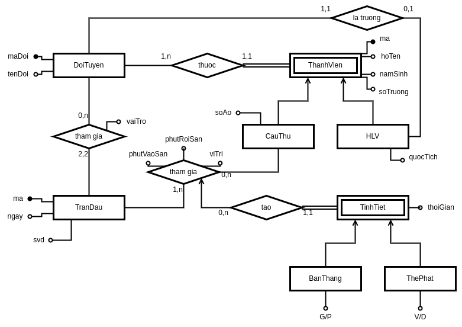
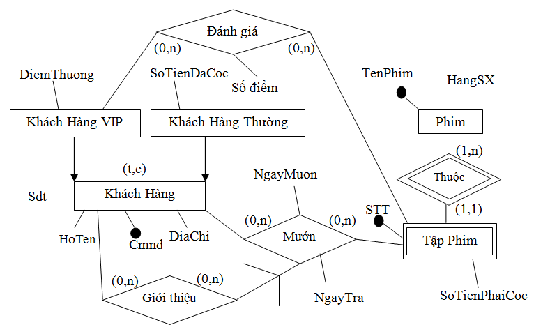
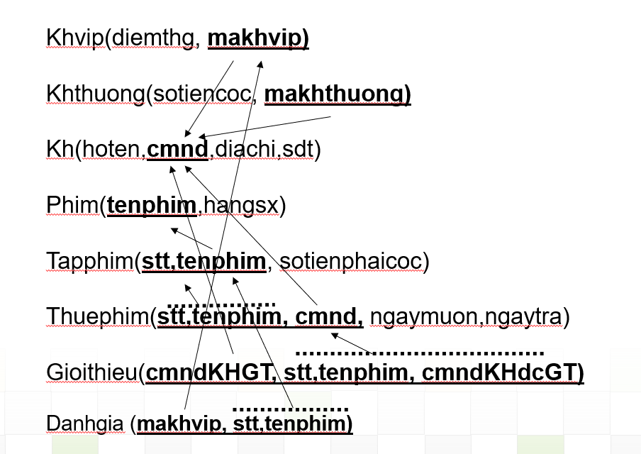
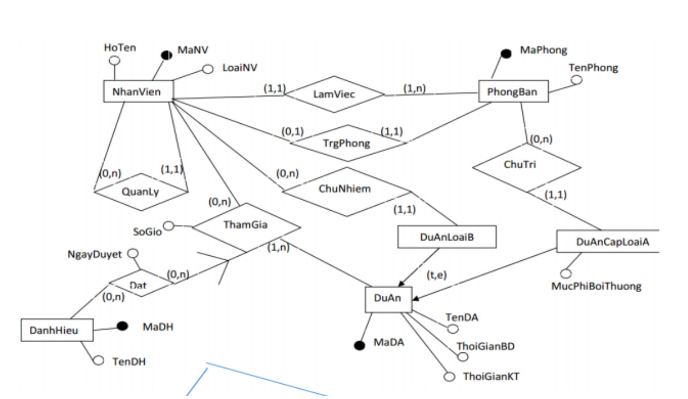
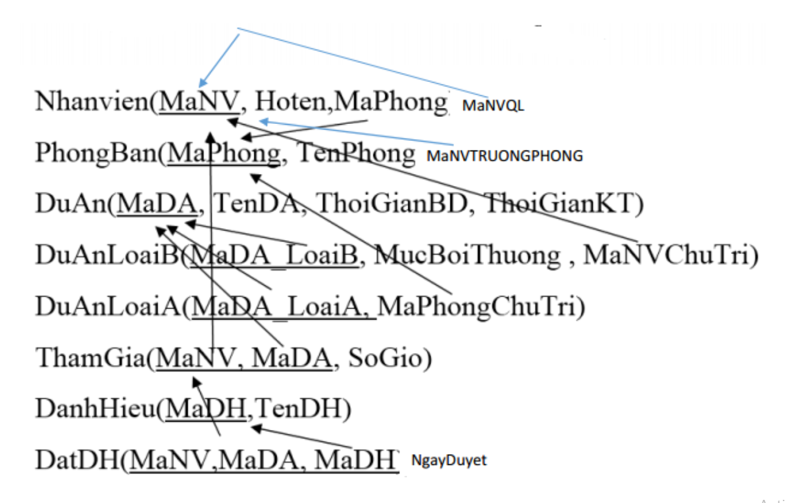
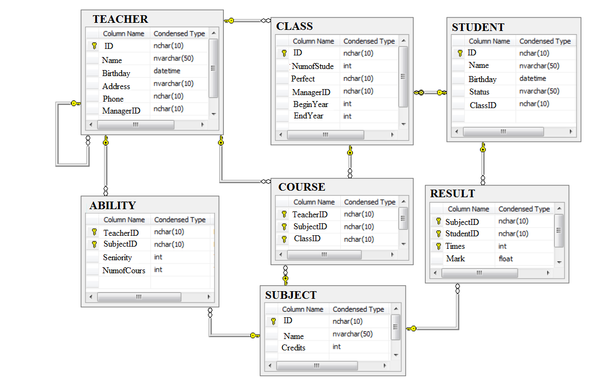

# 1. Business to ER

Liên đoàn bóng đá thế giới cần xây dựng 1 CSDL để quản lý các trận bóng đá giao hữu của các đội tuyển quốc gia. &emsp; &emsp; Mỗi đội tuyển quốc gia cần lưu các thông tin như sau: mỗi đội tuyển có mã đội duy nhất, tên đội, mỗi đội tuyển có nhiều cầu thủ và thành viên trong ban huấn luyện (gọi chung là thành viên). &emsp; Mỗi thành viên cần quản lý những thông tin như sau: mã thành viên, họ tên, năm sinh, sở trường. &emsp; Mã thành viên chỉ phân biệt được các thành viên trong cùng 1 đội tuyển. &emsp; Nếu thành viên này là cầu thủ thì có một số áo. &emsp; Nếu thành viên là 1 người trong ban huấn luyện thì có thêm thông tin quốc tịch. &emsp; Mỗi đội bóng phải có 1 huấn luyện viên trưởng, huấn luyện viên trưởng này là 1 thành viên trong ban huấn luyện. &emsp; Mỗi trận đấu diễn ra cần lưu lại mã trận đấu, ngày diễn ra trận đấu, thông tin hai đội tham gia (đội nhà, đội khách), màu áo thi đấu của mỗi đội, sân vận động diễn ra trận đấu. &emsp; Cần ghi nhận lại danh sách các cầu thủ của mỗi đội tham gia trận đấu, vị trí thi đấu tương ứng của cầu thủ trong trận đấu (thủ môn, hậu vệ, tiền vệ, trung vệ, tiền đạo). &emsp; Mỗi cầu thủ có thể tham gia trận đấu từ đội hình xuất phát hoặc vào sân từ ghế dự bị. &emsp; Cần lưu lại danh sách các bàn thắng, thẻ phạt của mỗi trận đấu. &emsp; Thông tin bàn thắng hoặc thẻ phạt cần ghi nhận lại do cầu thủ nào ghi/bị phạt, thời gian ghi bàn/ bị phạt. &emsp; Với mỗi bàn thắng cần ghi rõ ghi bàn hay phản lưới nhà. &emsp; Với thẻ phạt cần ghi nhận loại thẻ (thẻ vàng, thẻ đỏ).



<br />
<br />
<br />
<br />
<br />

# 2. ER to Relational DB

## a. Dịch vụ thuê phim




## b. Quản lí nhân viên




<br />
<br />
<br />
<br />
<br />
<br />


# 3. SQL



## a. Teacher

- List the **teachers** born in 1992 who have been **assigned** to **manage** the class.

```sql
select t.*
from teacher t, class c
where Year(t.birthday) = 1992
	and t.ID=c.ManagerID
```

- List the **teachers** born in 1992 who were **never** assigned to **manage** the class.

```sql
select t.*
from teacher t
where Year(t.birthday) = 1992
	and t.ID not in (
		select c.managerID
		from Class c
	)
```

<br />
<br />
<br />

- **Count** the times that the **teacher** "Nguyen Van An" was assigned to **teach** the class 'LH0004'

```sql
select count(*) as 'SL'
from teacher t,
	course c
where t.name = 'Nguyen Van An'
	and c.teacherID = t.ID
	and c.classID = 'LH0004'
```

- List the **teachers** assigned to **teach** "Data Mining".

```sql
select distinct t.*
from subject s,
	course c,
	teacher t
where s.name = 'Data Mining'
	and c.subjectID = s.ID
	and t.id = c.teacherID
```

- List the **teachers** who are **managed by** another **teacher**. Provide the information including the teacher name and the manager name.

```sql
select t.name,
	m.name
from teacher t,
	teacher m
where t.managerID = m.ID
```


## b. Student

### i. Role

- Indicate the **students** who are **leaders** of classes with the starting year of 2016

```sql
select s.*
from student s,
	class c
where s.id = c.perfect
	and c.beginyear = 2016
```

<br />
<br />
<br />


- List the perfect for class ending in 2015.

```sql
select s.*
from student s,
	class c
where c.endyear = 2015
	and c.perfect = s.ID
```

### ii. Passed

- List the **students** who **passed** 'Computer Network'

```sql
select s.*
from subject su,
	result r,
	student s
where su.Name = 'Computer Network'
	and r.subjectID = su.ID
	and r.studentID = s.ID
	and r.mark >= 5
	and r.times >= all (
		select r1.times
		from result r1
		where r1.studentID = r.studentID
			and r1.subjectID = r.subjectID
	)
```

- Show how many **students** have **passed** "Basic Informatics".

```sql
select count(*) as 'SLSV'
from student s,
	result r,
	subject su
where s.ID = r.studentID
	and r.subjectID = su.ID
	and su.name = "Basic Informatics"
	and r.mark >= 5
	and r.times >= all (
		select r1.times
		from result r1
		where r1.studentID = s.ID
			and r1.subjectID = su.ID
	)
```

<br />

- Provide information about **students** who have **pass** the **most** number of subjects.

```sql
select s.ID, s.name,count(*)
from student s,
result r,
subject su
where s.id = r.studentID
	and r.subjectID = su.ID
	and r.mark >= 5
	and r.times >= all (
		select r1.times
		from result r1
		where r1.studentID = s.ID
			and r1.subjectID = su.ID
	)
group by s.ID,s.name
having count(*) >= all (
	select count(*)
	from student s1,
		result r1,
		subject su1
		where s1.id=r1.studentID
			and r1.subjectID = su1.ID
			and r.mark >= 5
			and r1.times = all (
				select r2.times
				from result r2
				where r2.studentID = s1.ID
					and r2.subjectID = su1.ID
			)
		group by s1.ID
	)
```

- Show all **students** who **failed** all **4-credit subjects** => _For each student, count the number of 4-credit subjects failed = the number of 4-credit subjects_

```sql
select s.ID
from student s,
	results r,
	subject su
where s.ID = r.studentID
	and r.mark < 5
	and r.subjectID = su.ID
	and su.credit = 4
	and r.times >= all (
		select r1.times
		from result r1
		where r1.studentID = r.studentID
			and r1.subjectID = r.subjectID
	)
group by s.ID
having count(*) = (
	select count(*)
	from subject
	where credit = 4
)
```

### iii. Mark

- Provide information about **students** who have the **highest** mark in 'Computer Networks'

```sql
select s.name
from student s,
	result r,
	subject su
where s.id = r.studentID
	and r.subjectID=su.ID
	and su.name='Computer Networks'
	and r.mark >= all (
		select r1.mark
		from result r1,
		subject su1
		where r1.subjectID = su1.ID
		and su1.name = 'Computer Networks'
	)
```

- Indicate the **GPA** of the student 'Nguyen Van An'

```sql
select sum(r.mark * su.credit) / sum(su.credit) as 'GPA'
from student s,
	result r,
	subject su
where s.name = 'Nguyen Van An'
	and s.id = r.studentID
	and r.subjectID = su.ID
	and r.mark >= 5
	and r.times >= all (
		select r1.times
		from result r1
		where r1.studentID = r.studentID
			and r1.subjectID = r.subjectID
	)
```

<br />
<br />
<br />
<br />

### iv. Relationship

- Indicate the **students** who are **managed by** teacher Nguyen Van An and have **never taken the exams** of any **4-credit subjects**

```sql
select s.*
from teacher t,
	class c,
	student s
where t.name = 'Nguyen Van An'
	and c.manageID = t.ID
	and s.classID = c.ID
	and s.id not in (
		select r.studentID
		from result r,
			subject su
		where r.subjectID = su.ID
			and su.credits = 4
	)
```

- Show **students** who are in the **same class** as Nguyen Van An and **pass** the database **subject**

```sql
select s.*
from student nva,
	student s,
	result r,
	subject su
where nva.name = 'Nguyen Van An'
	and s.classID = nva.classID
	and s.ID = r.studentID
	and r.subjectID = su.ID
	and su.name = 'Database'
	and r.mark >= 5
	and r.times >= all (
		select r1.times
		from result r1
		where r1.studentID = r.studentID
			and r1.subjectID = r.subjectID
	)
```

<br />
<br />
<br />
<br />
<br />
<br />
<br />
<br />


## c. Class & Subject

- For each **subject**, indicate the **number** of **students** who has **passed** it.

```sql
select su.Name,
	count(*) as 'SL'
from Result r,
	student s,
	subject su
where r.studentID = s.ID
	and s.subjectID = su.ID
	and r.mark >= 5
	and r.times >= all (
		select r1.times
		from result r1
		where r1.studentID = r.studentID
			and r1.subjectID= r.subjectID
	)
group by su.ID, su.Name
```

- List **subject** that more than **four** students **passed**.

```sql
select su.Name,
count(*) as 'SL'
from Result r,
	student s,
	subject su
where r.studentID = s.ID
	and s.subjectID = su.ID
	and r.mark >= 5
	and r.times >= all (
		select r1.times
		from result r1
		where r1.studentID = r.studentID
			and r1.subjectID = r.subjectID
	)
group by su.ID, su.Name
having count(*) > 4
```

- List the name of the **subjects** that the **teacher** named "Nhan Lan" was **assigned** to teach.

```sql
select distinct s.name
from teacher t,
	course c,
	subject s
where t.name = 'Nhan Lan'
	and t.id = c.teacherID
	and c.subjectID = s.ID
```

- List the **subjects** that the **student** named "Kieu" **studies**

```sql
select c.subjectID
from student s,
	course c
where s.name like '%Kieu'
	and c.classID = s.classID
```

- Show the **classes** started in 2016 and have the **most** number of **students passed** the database subject.

```sql
select c.ID
from result r,
	student s,
	class c,
	subject su
where r.studentID = s.ID
	and c.ID = s.classID
	and c.beginyear = 2016
	and r.subjectID = su.ID
	and su.Name = 'Database'
	and r.mark >= 5
	and r.times >= all (
		select r1.times
		from result r1
		where r1.studentID = r.studentID
			and r1.subjectID = r.subjectID
	)
	group by c.ID
	having count(*) >= all (
		select count(*)
		from result r1,
			student s1,
			class c1,
			subject su1
		where r1.studentID = s1.ID
			and s1.classID = c1.ID
			and c1.beginyear = 2016
			and r1.subjectID = su1.ID
			and su1.Name = 'Database'
			and r1.mark >= 5
			and r1.times >= all (
				select r2.times
				from result r2
				where r2.studentID = r1.studentID
					and r2.subjectID = r1.subjectID
			)
		group by c1.ID
	)
```

<br />

# 4. Datamining

## a. Association rule

A transaction database is as follows:

```
1. X,Y,Z,G
2. Y,Z,H,X
3. G,H,K,M
4. X,Y,Z,M
5. M,N,Z
6. X,Y,N
```

`minsupp` = 0.4; `minconf` = 0.7

_**{X, Y} is a frequent itemset?**_

	#{X,Y} / #all = 4/6 = 0.67 > minsup
	=> {X, Y} is a frequent itemset

_**{XY} - {Z} is an association rule?**_

	#{XYZ} / #all  = 3/6 = 0.5  > minsup
	#{XYZ} / #{XY} = 3/4 = 0.75 > minconf
	=> {XY} - {Z} is an association rule

## b. Classification

A training dataset is as follows:

|  ID   |  F1   |  F2   |  F3   | Class |
| :---: | :---: | :---: | :---: | :---: |
|   1   |   2   |   3   |   4   |   A   |
|   2   |   1   |   1   |   1   |   B   |
|   3   |   5   |   2   |   2   |   A   |
|   4   |   4   |   2   |   3   |   B   |
|   5   |   3   |   2   |   4   |   A   |
|   6   |   2   |   3   |   2   |   ?   |

_**Using algorithm "k nearest neighbors" with k = 3. Indicate the
class of the 6th object**_

### 1. Showing results after min-max normalization

Min(F1) = 1; Max(F1) = 5

Min(F2) = 1; Max(F2) = 3

Min(F3) = 1; Max(F3) = 4

> _Formula:_ `(x - min) / (max - min)`

| ID 	| F1               	| F2              	| F3               	| Class 	|
|:--:	|------------------	|-----------------	|------------------	|:-----:	|
|  1 	| `(2-1) / (5-1) = 0.25` 	| `(3-1) / (3-1) = 1`   	| `(4-1) / (4-1) = 1`    	|   A   	|
|  2 	| `(1-1) / (5-1)  =  0`    	| `(1-1) / (3-1)  =  0`   	| `(1-1) / (4-1) = 0`    	|   B   	|
|  3 	| `(5-1) / (5-1) = 1`    	| `(2-1) / (3-1) = 0.5` 	| `(2-1) / (4-1) = 0.33` 	|   A   	|
|  4 	| `(4-1) / (5-1) = 0.75` 	| `(2-1) / (3-1) = 0.5` 	| `(3-1) / (4-1) = 0.67` 	|   B   	|
|  5 	| `(3-1) / (5-1) = 0.5`  	| `(2-1) / (3-1) = 0.5` 	| `(4-1) / (4-1) = 1`    	|   A   	|
|  6 	| `(2-1) / (5-1) = 0.25`	| `(3-1) / (3-1) = 1`   	| `(2-1) / (4-1) = 0.44` 	|   ?   	|

### 2. Calculate Euclidean similarity

> _Formula:_ `sqrt( (F1 - F1')^2 + (F2 - F2')^2 + (F3 - F3')^2 )`

Sim(06, 05) = `sqrt( (0.25-0.5)^2 + (1-0.5)^2 + (0.44-1)^2 )` = 0.791

Sim(06, 04) = `sqrt( (0.25-0.75)^2 + (1-0.5)^2 + (0.44-0.67)^2 )` = 0.744

Sim(06, 03) = `sqrt( (0.25-1)^2 + (1-0.5)^2 + (0.44-0.33)^2 )` = 0.908

Sim(06, 02) = `sqrt( (0.25-0)^2 + (1-0)^2 + (0.44-0)^2 )` = 1.121

Sim(06, 01) = `sqrt( (0.25-0.25)^2 + (1-1)^2 + (0.44-1)^2 )` = 0.56


### 3. Conclusion

Choose 3 nearest neighbors: **01, 04, 05**

Decide the class of the 6th object: **A**

# 5. Datawarehouse

A data warehouse is a subject-oriented, integrated, time-variant and non-volatile collection of data in support of management's decision making process.

A data warehouse can retrieves and consolidates data periodically from the source systems into a dimensional or normalized data store
